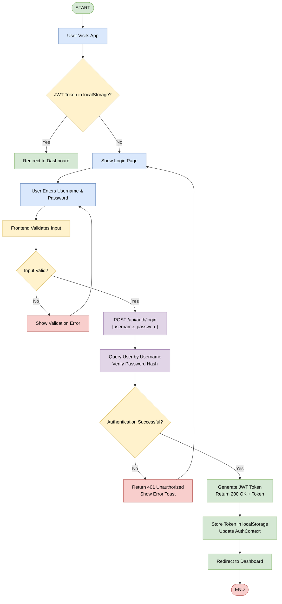
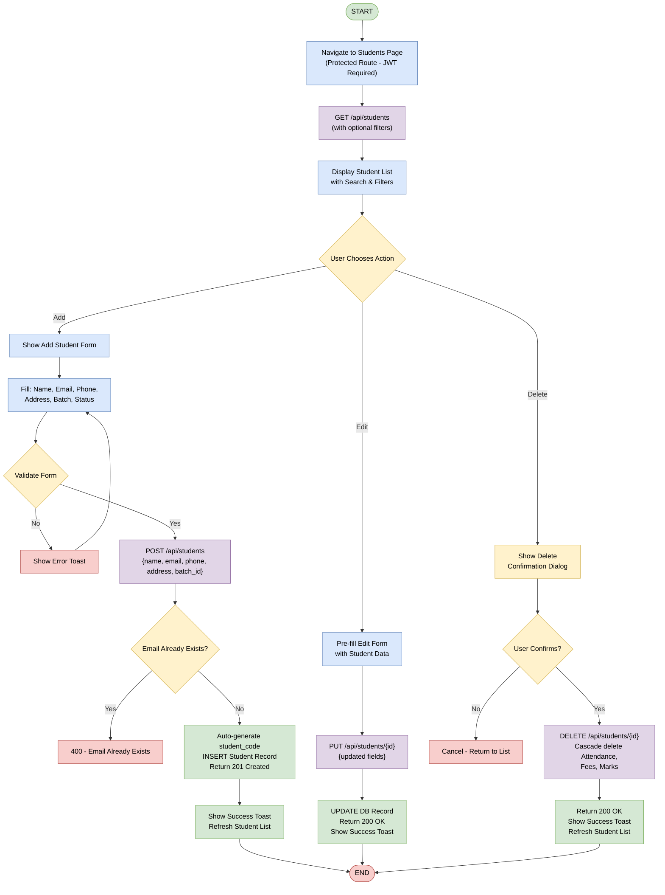
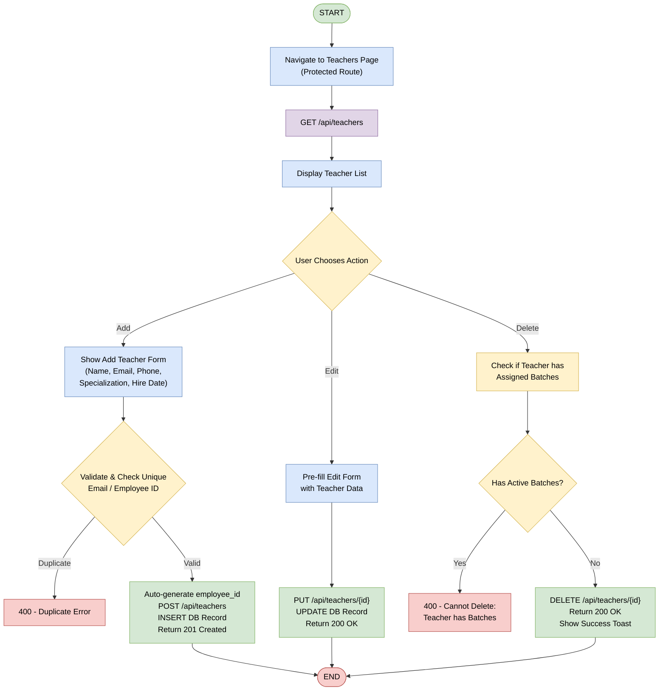
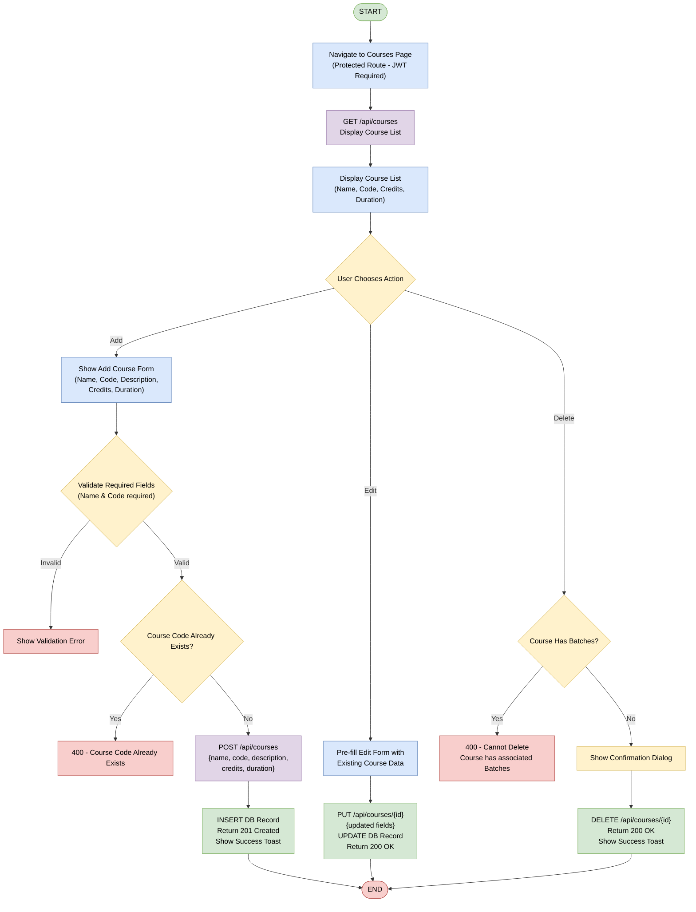
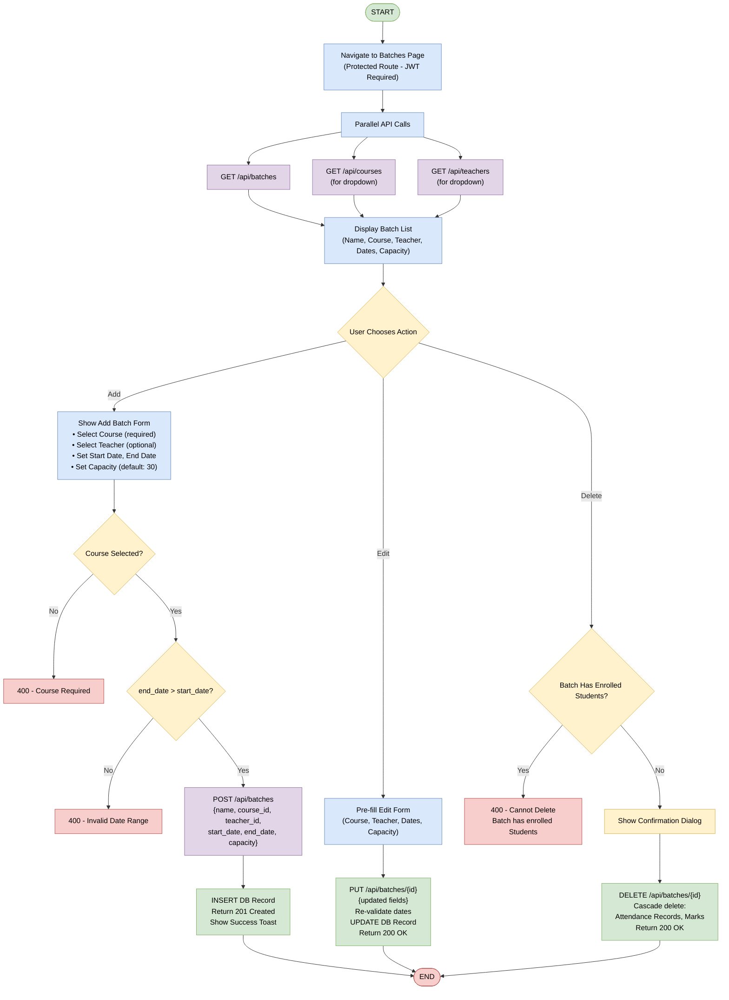
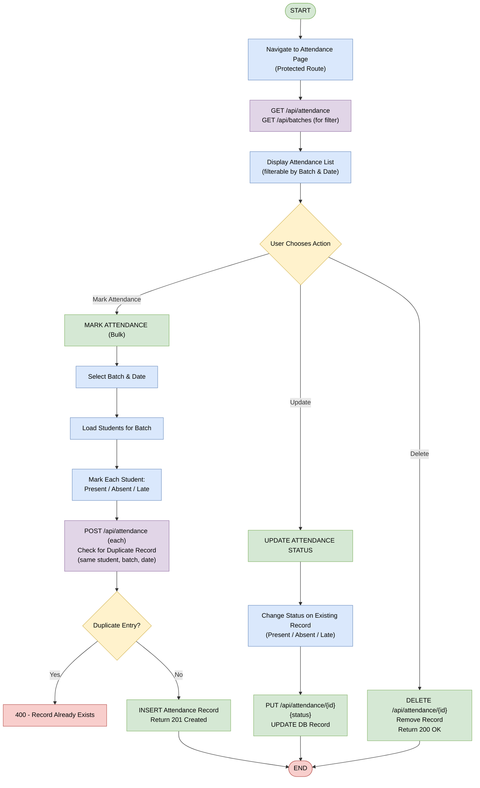
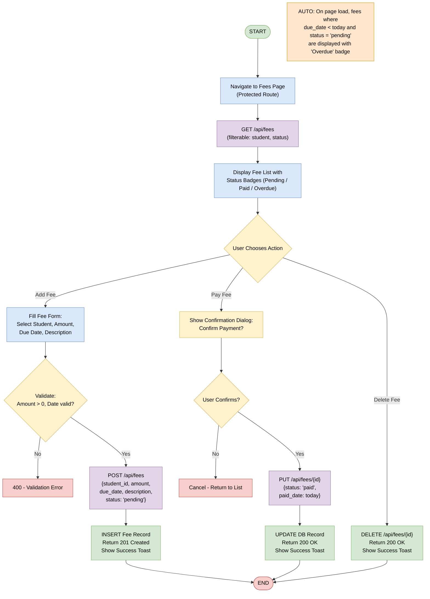
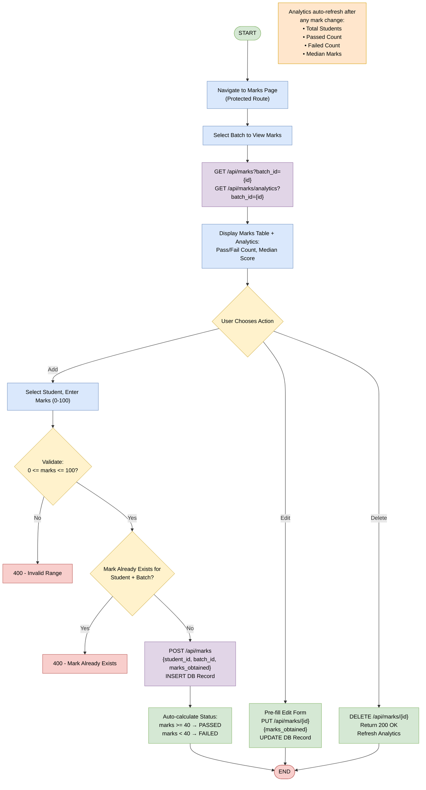
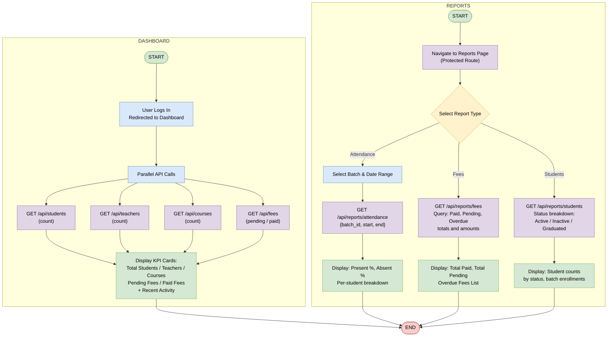

# Architecture Diagrams

This document contains the complete application flowcharts for every module of **OpenCampusPro** — the Student Management System.  
All diagrams are written in [Mermaid](https://mermaid.js.org/) and render natively on GitHub.

## Colour Legend

| Colour | Meaning |
|---|---|
| 🟢 Green | Start / End / Success state |
| 🔵 Blue | UI / Frontend action |
| 🟣 Purple | API / Backend call |
| 🟡 Yellow | Decision / Condition |
| 🔴 Red | Error / Failure state |
| 🟠 Orange | Informational note |

---

## Table of Contents

1. [Authentication](#1-authentication-flow)
2. [Student Management](#2-student-management-flow)
3. [Teacher Management](#3-teacher-management-flow)
4. [Course Management](#4-course-management-flow)
5. [Batch Management](#5-batch-management-flow)
6. [Attendance Management](#6-attendance-management-flow)
7. [Fee Management](#7-fee-management-flow)
8. [Marks Management](#8-marks-management-flow)
9. [Reports & Dashboard](#9-reports--dashboard-flow)

---

## 1. Authentication Flow

---

## 2. Student Management Flow

---

## 3. Teacher Management Flow

---

## 4. Course Management Flow

---

## 5. Batch Management Flow

---

## 6. Attendance Management Flow

---

## 7. Fee Management Flow

---

## 8. Marks Management Flow

---

## 9. Reports & Dashboard Flow

