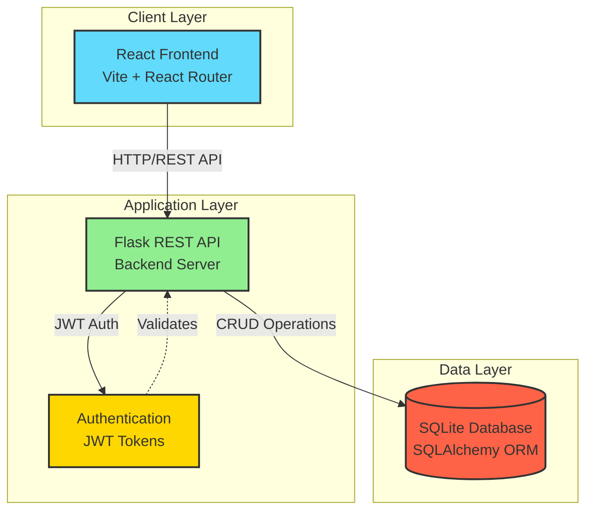
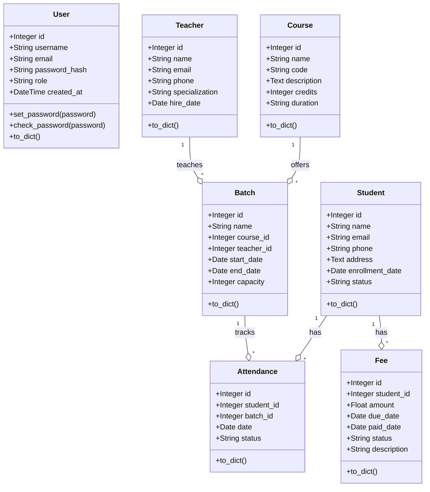
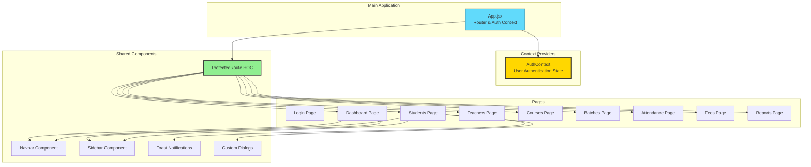
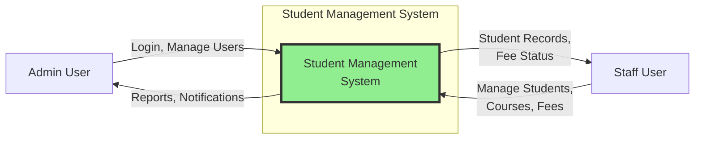
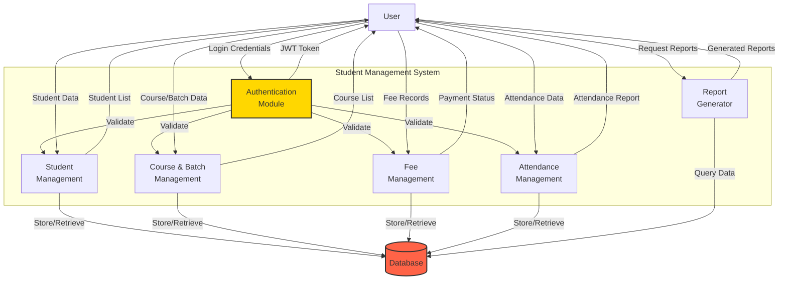
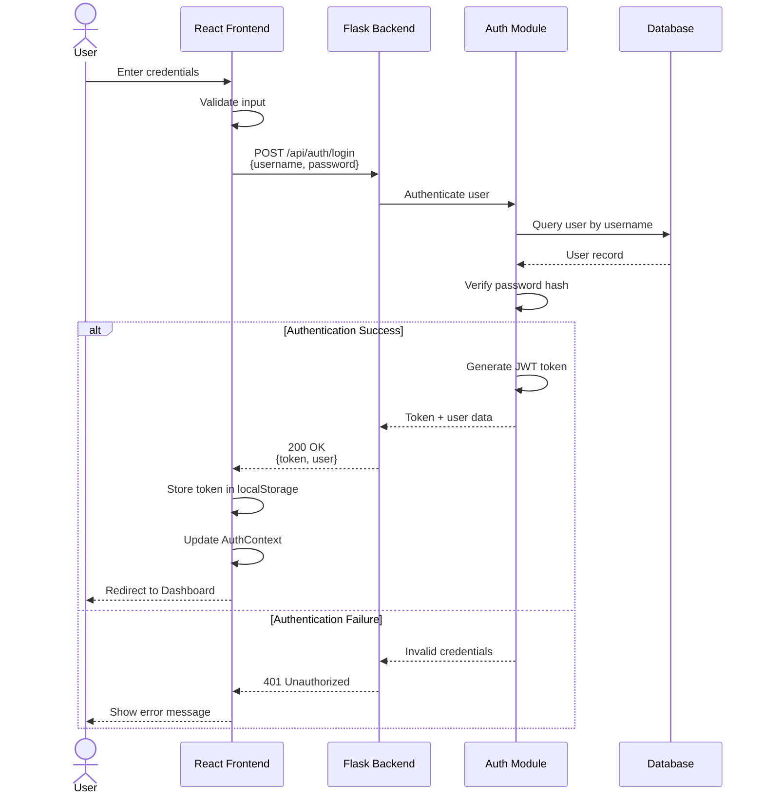
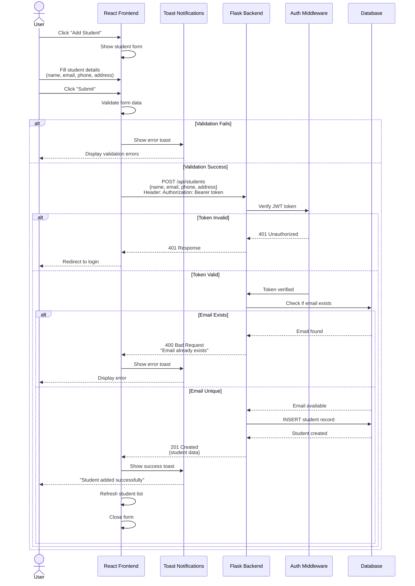
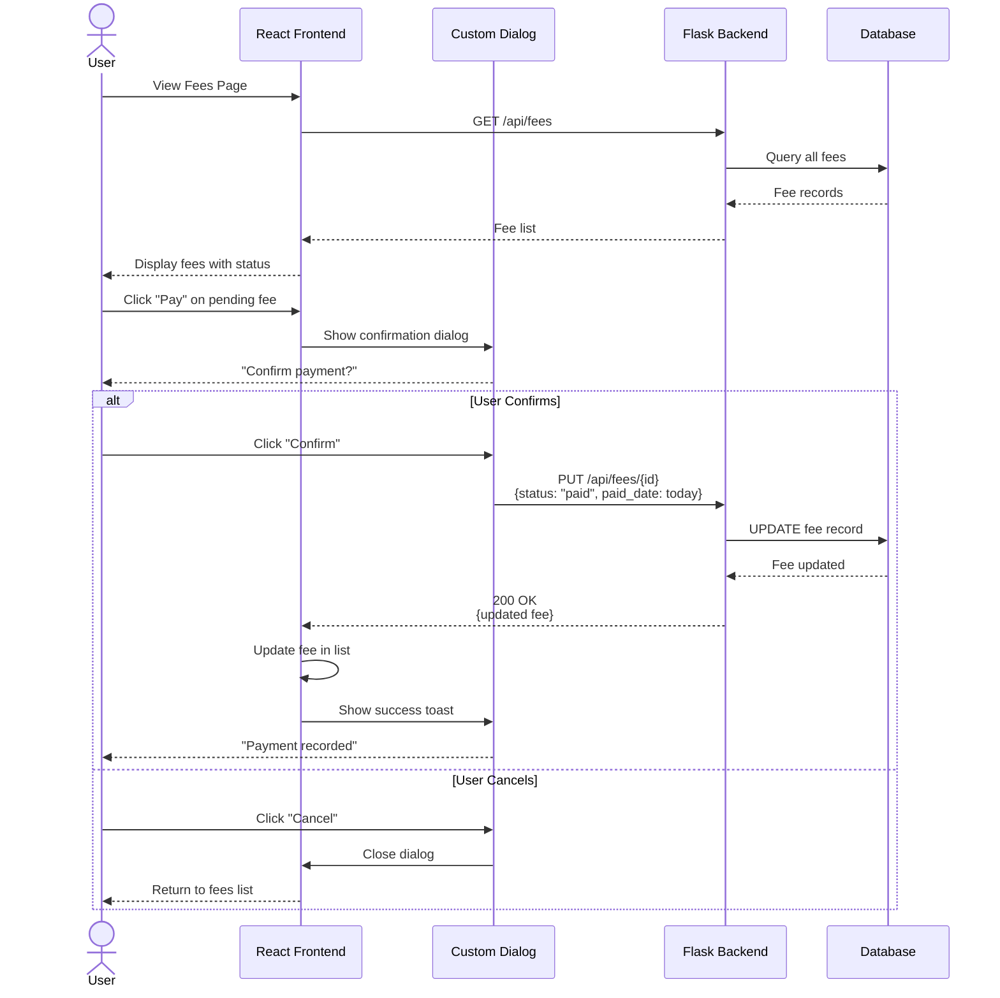

# Student Management System - Architecture Diagrams

This document contains comprehensive diagrams that document the architecture, components, data flow, and key processes of the Student Management System.

---

## 1. High-Level Architecture Diagram

This diagram shows the overall system architecture with the three main layers: Frontend (React), Backend (Flask), and Database (SQLite).

---

## 2. Low-Level Diagrams

### 2.1. Backend Class Diagram (Database Models)

This diagram shows all SQLAlchemy models and their relationships in the backend.

### 2.2. Frontend Component Diagram

This diagram shows the structure of React components and pages in the frontend.

---

## 3. Data Flow Diagrams (DFD)

### 3.1. Level 0 - System Context Diagram

### 3.2. Level 1 - Detailed Data Flow

---

## 4. Sequence Diagrams

### 4.1. Login Process

This sequence diagram shows the detailed flow of user authentication.

### 4.2. Add Student Process

This sequence diagram shows the flow of adding a new student record.

### 4.3. Fee Payment Process

This sequence diagram shows the workflow for processing fee payments.

---

## Summary

These diagrams provide a comprehensive view of the Student Management System:

1. **High-Level Architecture**: Shows the three-tier architecture (Frontend, Backend, Database)
2. **Low-Level Class Diagram**: Details all database models and their relationships
3. **Low-Level Component Diagram**: Maps out the React component hierarchy
4. **Data Flow Diagrams**: Illustrate how data flows through the system at different abstraction levels
5. **Sequence Diagrams**: Document the step-by-step execution of critical workflows (Login, Add Student, Fee Payment)

These diagrams serve as essential documentation for understanding, maintaining, and extending the system.
